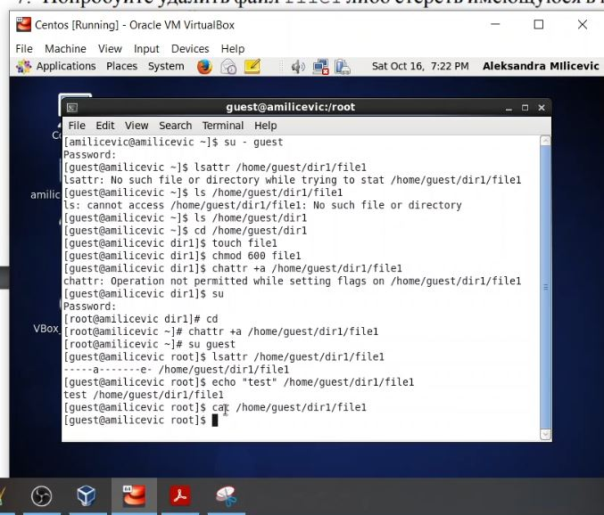
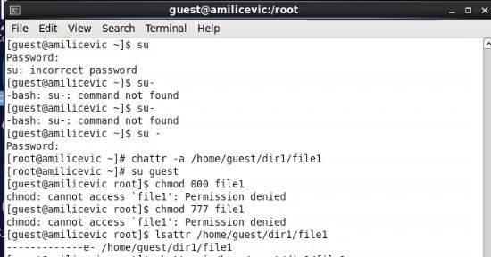
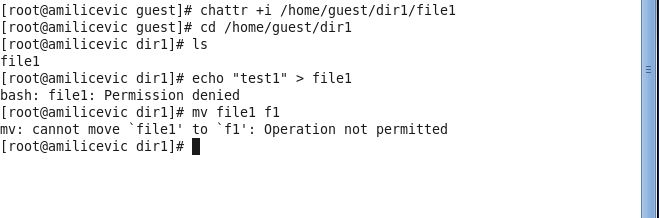
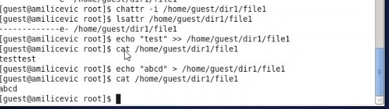

---
# Front matter
lang: ru-RU
title: "Отчёт по лабораторной работе №4"
subtitle: "дисциплина: Информационная безопасность"
author: "Миличевич Александра"

# Formatting
toc-title: "Содержание"
toc: true # Table of contents
toc_depth: 2
lof: true # List of figures
lot: true # List of tables
fontsize: 12pt
linestretch: 1.5
papersize: a4paper
documentclass: scrreprt
polyglossia-lang: russian
polyglossia-otherlangs: english
mainfont: PT Serif
romanfont: PT Serif
sansfont: PT Sans
monofont: PT Mono
mainfontoptions: Ligatures=TeX
romanfontoptions: Ligatures=TeX
sansfontoptions: Ligatures=TeX,Scale=MatchLowercase
monofontoptions: Scale=MatchLowercase
indent: true
pdf-engine: lualatex
header-includes:
  - \linepenalty=10 # the penalty added to the badness of each line within a paragraph (no associated penalty node) Increasing the value makes tex try to have fewer lines in the paragraph.
  - \interlinepenalty=0 # value of the penalty (node) added after each line of a paragraph.
  - \hyphenpenalty=50 # the penalty for line breaking at an automatically inserted hyphen
  - \exhyphenpenalty=50 # the penalty for line breaking at an explicit hyphen
  - \binoppenalty=700 # the penalty for breaking a line at a binary operator
  - \relpenalty=500 # the penalty for breaking a line at a relation
  - \clubpenalty=150 # extra penalty for breaking after first line of a paragraph
  - \widowpenalty=150 # extra penalty for breaking before last line of a paragraph
  - \displaywidowpenalty=50 # extra penalty for breaking before last line before a display math
  - \brokenpenalty=100 # extra penalty for page breaking after a hyphenated line
  - \predisplaypenalty=10000 # penalty for breaking before a display
  - \postdisplaypenalty=0 # penalty for breaking after a display
  - \floatingpenalty = 20000 # penalty for splitting an insertion (can only be split footnote in standard LaTeX)
  - \raggedbottom # or \flushbottom
  - \usepackage{float} # keep figures where there are in the text
  - \floatplacement{figure}{H} # keep figures where there are in the text
---

# Цель работы

Получение практических навыков работы в консоли с расширенными
атрибутами файлов1
.

# Выполнение лабораторной работы

**Последовательность выполнения работы*

1. Рассширение аттрибута
{ #fig:001 width=70% }
Итак, вы можете видеть, что мы могли добавить в файл сейчас, 
но не могли редактировать существующую информацию в файле, а также удалить файл. 
Чтобы изменить это поведение, просто используем параметр -a.
До сих пор, чтобы проверить, был ли успешно применен атрибут chattr, мы пробовали выполнять такие операции, как редактирование файла. 
Но есть отдельная команда, которая позволяет легко увидеть, были ли применены атрибуты или нет. Рассматриваемая команда - lsattr.
2. Сhmod permission denied

{ #fig:002 width=70% }

3. Добавление аттрибута i вместо a
{ #fig:003 width=70% }
Предположим, мы хотим сделать файл доступным только для чтения. Итак, все, что нам нужно сделать, это запустить команду chattr с параметром + i и именем файла в качестве входных данных.
мы видим, что мы тоже не можем его переименовать
4. Переименование файла
{ #fig:002 width=70% }

# Выводы

Получила практические навыков работы в консоли с атрибутами a и i.
