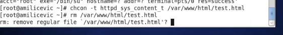

---
# Front matter
lang: ru-RU
title: "Отчёт по лабораторной работе №6"
subtitle: "дисциплина: Информационная безопасность"
author: "Миличевич Александра"

# Formatting
toc-title: "Содержание"
toc: true # Table of contents
toc_depth: 2
lof: true # List of figures
lot: true # List of tables
fontsize: 12pt
linestretch: 1.5
papersize: a4paper
documentclass: scrreprt
polyglossia-lang: russian
polyglossia-otherlangs: english
mainfont: PT Serif
romanfont: PT Serif
sansfont: PT Sans
monofont: PT Mono
mainfontoptions: Ligatures=TeX
romanfontoptions: Ligatures=TeX
sansfontoptions: Ligatures=TeX,Scale=MatchLowercase
monofontoptions: Scale=MatchLowercase
indent: true
pdf-engine: lualatex
header-includes:
  - \linepenalty=10 # the penalty added to the badness of each line within a paragraph (no associated penalty node) Increasing the value makes tex try to have fewer lines in the paragraph.
  - \interlinepenalty=0 # value of the penalty (node) added after each line of a paragraph.
  - \hyphenpenalty=50 # the penalty for line breaking at an automatically inserted hyphen
  - \exhyphenpenalty=50 # the penalty for line breaking at an explicit hyphen
  - \binoppenalty=700 # the penalty for breaking a line at a binary operator
  - \relpenalty=500 # the penalty for breaking a line at a relation
  - \clubpenalty=150 # extra penalty for breaking after first line of a paragraph
  - \widowpenalty=150 # extra penalty for breaking before last line of a paragraph
  - \displaywidowpenalty=50 # extra penalty for breaking before last line before a display math
  - \brokenpenalty=100 # extra penalty for page breaking after a hyphenated line
  - \predisplaypenalty=10000 # penalty for breaking before a display
  - \postdisplaypenalty=0 # penalty for breaking after a display
  - \floatingpenalty = 20000 # penalty for splitting an insertion (can only be split footnote in standard LaTeX)
  - \raggedbottom # or \flushbottom
  - \usepackage{float} # keep figures where there are in the text
  - \floatplacement{figure}{H} # keep figures where there are in the text
---

# Цель работы

Развить навыки администрирования ОС Linux. Получить первое практическое знакомство с технологией SELinux1
Проверить работу SELinx на практике совместно с веб-сервером
Apache.

# Выполнение лабораторной работы

**Последовательность выполнения работы*

1. SELinux 
— набор технологий расширения системы безопасности Linux. Сегодня основу набора составляют три технологии: мандатный контроль доступа,
ролевой доступ RBAC и система типов (доменов). Apache – это свободное программное обеспечение для размещения веб-сервера. Он хорошо показывает
себя в работе с масштабными проектами, поэтому заслуженно считается одним
из самых популярных веб-серверов. Кроме того, Apache очень гибок в плане
настройки, что даёт возможность реализовать все особенности размещаемого
веб-ресурса

В конфигурационном файле /etc/httpd/httpd.conf задала параметр
ServerName. 
{ #fig:002 width=70% }

Отключила фильтр командами: iptables -F, iptables -P INPUT ACCEPT
iptables -P OUTPUT ACCEPT. Так же добавила разрешающие правила.

{ #fig:002 width=70% }

2. Вход в систему
Вошла в систему и убедилась, что
SELinux работает в режиме enforcing политики targeted с помощью команд
getenforce и sestatus

{ #fig:002 width=70% }

Обратилась с помощью браузера к веб-серверу, запущенному на компьютере

{ #fig:002 width=70% }

{ #fig:002 width=70% }

3. веб-сервер Apache
Нашла веб-сервер Apache в списке процессов, определила его контекст
безопасности.
{ #fig:002 width=70% }

Посмотрела текущее состояние переключателей SELinux для Apache с помощью команды: 
**sestatus -bigrep httpd.
{ #fig:002 width=70% }

Определила тип файлов и поддиректорий, находящихся в директории /var/www, с
помощью команды: ls -lZ /var/www. Определила тип файлов, находящихся
в директории /var/www/html: ls -lZ /var/www/html. Определила круг пользователей, которым разрешено создание файлов в директории /var/www/html.

{ #fig:002 width=70% }

Создала от имени суперпользователя (так как в дистрибутиве после
установки только ему разрешена запись в директорию) html-файл
/var/www/html/test.html

{ #fig:002 width=70% }

Проверила контекст созданного файла. httpd_sys_content_t

{ #fig:002 width=70% }

Обратилась к файлу через веб-сервер, введя в браузере адрес http://127.0.0.1/test.html.
 файл был успешно отображён

{ #fig:002 width=70% }

Проверила контекст файла командой: ls -Z /var/www/html/test.html 
Изменила контекст файла /var/www/html/test.html с httpd_sys_content_t на
samba_share_t. После этого проверила, что контекст поменялся.
Попробовала ещё раз получить доступ к файлу через веб-сервер, введя в
браузере адрес http://127.0.0.1/test.html. Получила сообщение failiure.

{ #fig:002 width=70% }

{ #fig:002 width=70% }

{ #fig:002 width=70% }

Файл не был отображён потому что мы изменили контекст файла. Просмотрела log-файлы веб-сервера Apache. Также
просмотрела системный лог-файл: tail /var/log/messages
{ #fig:002 width=70% }

{ #fig:002 width=70% }
 
в
файле /etc/httpd/httpd.conf нашла строчку Listen 80 и замените её на Listen
81. Проанализиировала лог-файлы. Просмотрела файлы /var/log/http/error_log,
/var/log/http/access_log и /var/log/audit/audit.log. (рис.18), (рис. 4.19), (рис.(рис. 20)

{ #fig:002 width=70% }

{ #fig:002 width=70% }

Вернула контекст httpd_sys_cоntent__t к файлу /var/www/html/test.html:
chcon -t httpd_sys_content_t /var/www/html/test.html.
Удалила файл /var/www/html/test.html

{ #fig:002 width=70% }

{ #fig:002 width=70% }

# Выводы

Получила первое практическое знакомство с технологией SELinux. Проверила
работу SELinx на практике совместно с веб-сервером Apache.